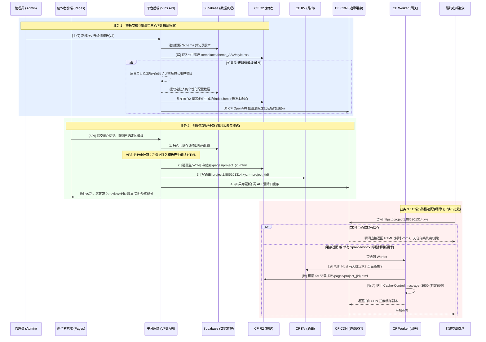

# RomanceSpace 平台前后端分离与 CQRS 读写架构详案

文档版本：v1.0
更新时间：2026-03-09

## 🌟 1. 架构核心思想：读写彻底分离 (CQRS)

为了在 Cloudflare 免费配额下支撑亿级并发“吃瓜”访问，同时支持后台模板编辑与创作者的复杂交互，本架构确立了一条铁律：

> **“让独立的 VPS 后端承担所有耗时的渲染、校验与写操作（体位重），让边缘的 Cloudflare Worker 退化成纯粹的高速的只读分发器（体位轻）。”**

### 为什么必须这样做？
1. **绕过 Worker 的“死刑”限制**：免费版 Worker 存在 10ms CPU 时间、限制 50 个子请求的硬约束。如果把“生成 HTML”、“渲染模板”和“遍历更新老用户”放在 Worker，只要并发量稍微提升或者模板更新涉及的老用户达到几十个，进程就会被 Cloudflare 强制掐断（Force Terminate），导致大规模数据损坏或丢失。
2. **极小化成本泄漏**：读写不分离的话，用户的每次访问都可能触发复杂的模板逻辑与重复查询，极大消耗 Worker 和 KV 读取次数。通过边缘缓存和提前预渲染（SSG），能够做到 90% 以上的访客访问达到 **0 Server 消耗**。
3. **消除耦合故障**：平台的管理界面、创作者编辑区如果挂了，完全不影响最终用户对生成好的个人主页的阅读与传播。

---

## 🏛 2. 核心架构与物理目录拆分

为了环境隔离防泄漏、统一团队心智开发负担，项目结构被**物理拆分**为 5 个完全独立的仓库结构：

### 目录 1：`RomanceSpace-Frontend` (平台前台与管理后台 UI)
*   **形态**：纯静态 SPA (React / Vue + Vite 或 Next.js 打包 static export)。
*   **部署位置**：Cloudflare Pages。
*   **职责**：提供可视化界面给创作者挑选模板、填写情话文本、上传音乐背景。它不处理任何逻辑，**只负责发送 AJAX (Fetch) 请求给 VPS API**。
*   **安全**：**切忌**在此项目包含任何数据库密码、R2 或 KV 的操作密钥 (Keys)。

### 目录 2：`RomanceSpace-Backend` (系统中央承重墙)
*   **形态**：Node.js API 服务 (Express、NestJS 或单起一个 Next.js API-Only 工程)。
*   **部署位置**：专有 VPS 服务器（配置 PM2 守护或 Docker 部署）。
*   **职责**：
    *   **唯一写权限持有者**：拥有操作数据库 (Supabase)、R2 存储、KV 和清理缓存的特权。
    *   **计算渲染核心**：执行 `injectData`，把模板与用户数据编织成最终生成的静态静态 `index.html`。
    *   **生命周期控制**：调用 Cloudflare 官方的 Zone Cache API 踢除废弃的边缘缓存。

### 目录 3：`RomanceSpace-Worker` (边缘分发网关)
*   **形态**：Cloudflare Worker。
*   **部署位置**：绑定泛域名（如 `*.885201314.xyz`）。
*   **职责**：
    *   **截获拦截**：检查 URL 中的主机名。去 KV 中查询其关联路由。
    *   **穿透抓取**：根据映射去 R2 提取 `*.html` 内容。
    *   **打标签**：向 Response 头硬编码追加 `Cache-Control: public, max-age=3600` 等缓存指令，丢回 CDN。

### 目录 4：`RomanceSpace-Docs`
*   **形态**：静态文档站点。专注维护开发对接文档，与业务流解耦。

### 目录 5：`RomanceSpace-Templates` (模板资产中心)
*   **形态**：纯静态资源包 (HTML + CSS + 图片)。
*   **部署位置**：由独立 CI/CD 流水线推送覆盖至 CF R2 的 `/templates` 目录。
*   **职责**：为所有创建的情话页面提供主题骨架，它是独立于主系统的“切图大军生产基地”。
---

## 🗺 3. 架构运行流转图 (Mermaid)

---

## 💣 4. 关键避坑与业务处理细节（防止后续层出不穷的 Bug）

### 避坑一：R2 存储垃圾堆积与过期连带错位
*   **错误做法**：每次生成/修改页面都创建新名字（如 `page_v1.html`, `page_v2.html`），同时手动调用 Delete 删除旧版。
*   **正确做法（0 垃圾法则）**：
    *   **针对管理端模板资产**：必须保留旧版本层级（存入 `/templates/{主题}/v1/`）。这样能保证老用户页面引用的骨架 CSS 永远不变形。
    *   **针对创作者的页面 HTML**：**永远采用同一个路径直接写入覆盖**（即 `/pages/{project_id}.html`）。既不产生垃圾占用容量，又节省一次 Delete 次数的钱，且极大简化运维逻辑。KV 在更新项目内容时也不需要改动。

### 避坑二：Worker 兜底更新的 50 请求极限（雪崩点）
*   **错误做法**：像现有代码一样，将管理员更新模板后的逻辑：查找老用户 -> 生成几百个页面 -> 写入 R2 全部用 `ctx.waitUntil` 挂载在 Worker 身上。
*   **正确做法（异步渲染解耦）**：VPS 接收到管理员的更新请求，仅更新新内容至 R2 的 assets。然后给管理后台返回成功，告知“模板已更新，正在后台升级老客户网页...”。随后在 VPS 内部启动 Job（如 BullMQ / cron / setInterval）分批次处理旧版本页面覆盖。从而把长达 1 分钟甚至 10 分钟的工作剥离出用户直连主流程流。

### 避坑三：作者频繁点击“缓存未刷新”，导致刷爆系统
*   **错误做法**：指望单节点的 `caches.default.delete()` 起作用。
*   **正确做法（Purge API + 防刷预览策略）**：
    *   **后台刷新**：后端更新 R2 完毕后，向 CF Global API (`/client/v4/zones/{your_zone_id}/purge_cache`) 投递精确到 URL 的 Purge 请求，全网剔除此缓存。
    *   **前端即时预览**：创作者点击预览时，追加 URL Query `?preview=123123`。
    *   **Worker 特殊配合**：若 Worker 发现存在 `?preview`，则使用 `fetch(r2Url, { cache: "no-store" })` 从 R2 硬拉取新档，回包同时要求浏览器不要缓存这个地址（`Cache-Control: no-cache, no-store`），确保实时性而不会污染 CDN 常规缓存。

---

## 🚧 5. 部署与重构优先级大纲 (Actionable Roadmap)

请严格按照以下从 P0 到底的优先级渐进式开发，确保不翻车：

### [P0 战役]：后端（VPS）基建搭建与接口对接
1.  **架构初始化**：初始化 `RomanceSpace-Backend` 项目（Node.js 或相关栈），连上你自己的 Supabase。
2.  **提取核心函数**：将原 Worker 里的 `index.js` 部分的 `injectData()`, `escapeHtml()` 代码复制到 VPS 的 Utils 中。
3.  **开发重写逻辑**：实现两个史诗核心接口供将来前端调取：
    *   `POST /api/project/render` (对应原 Worker /admin/render-page，加上 R2 强覆盖、数据库记录等)
    *   `POST /api/template/upload` (处理模板上传，实现自动分发到 R2 /templates 目录)

### [P1 战役]：Worker的“断臂求生”缩减大改造
1.  **清退废除功能**：打开现有的 `RomanceSpace-Worker/src/index.js`，毫不留情地删掉里面所有的 POST 接口、所有的上传逻辑、所有的 `env.ROMANCESPACE_KV.put`。
2.  **仅保留精简路由流转**：重写代码逻辑为：
    *   读 KV `host -> project_id`
    *   查是否含 `preview`。如果有，要求直接读 R2。
    *   正常情况：优先读本地 `caches.default.match()` 存单节点缓存，如未中，读 R2，并向 `caches.default.put()` 和给返回头加强力 `max-age=3600`。
    *   吐出 HTML 给调用者。

### [P2 战役]：前端纯净对接与后台升级机制
1.  **搭建界面**：开启 `RomanceSpace-Frontend`，构建纯净页面界面，移除一切 `.env` 敏感 key。所有操作全部基于 fetch 发往 `https://(VPS地址)/api/...`。
2.  **完善特级流程**：在 VPS 后台开发应对“管理员更新大版本模板后，异步重绘历史生成的老页面”任务，引入 Node 的批量操作框架。

*** 

### 💡 结论
这一份方案的底层支撑在于 **对成本敏感和组件极简主义的坚守**。只要遵循“一地写（VPS），一地读（Worker），重读覆盖不留痕”的 CQRS 原理，这个架构可以轻松横向拓展，面对流量海啸岿然不动。
